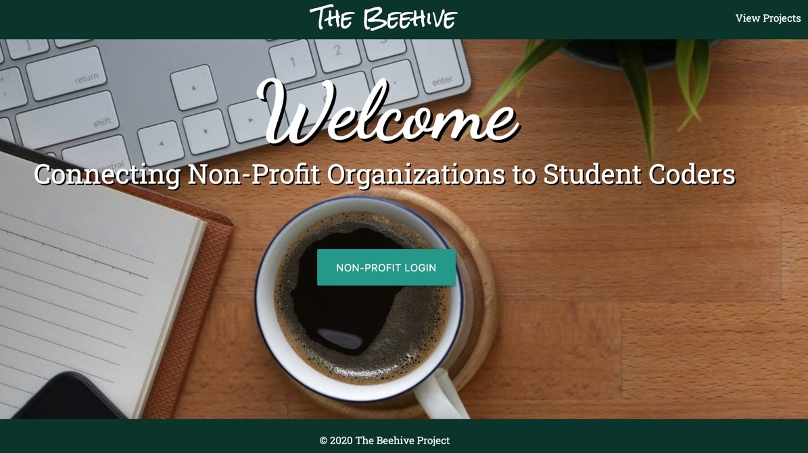
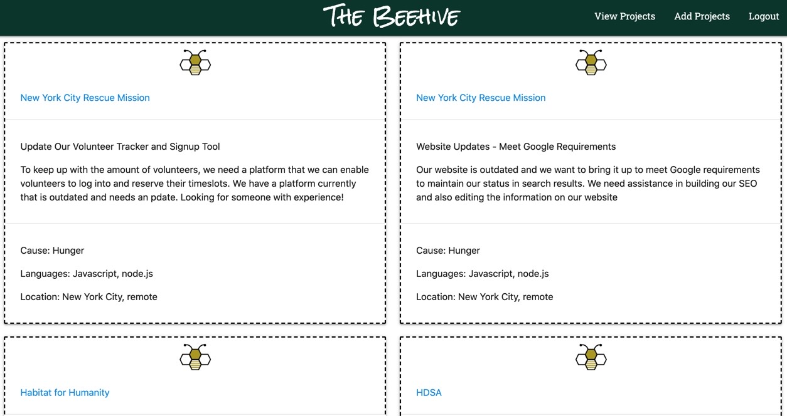
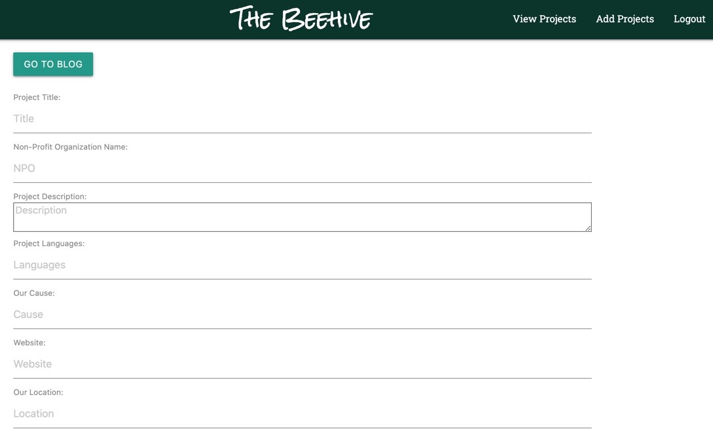

# The Beehive Project

### Table of Contents

1. [Description](#description)
2. [Installation](#installation)
3. [Usage](#usage)
4. [Contributions](#contribute)
5. [Test](#test)
6. [Questions](#questions)
7. [Links](#links)

### Description

The Beehive project brings together students/volunteers looking for real world experience with non-profit organizations. The npo's will post coding and tech projects they need completed, but can not afford to hire a full time staff member or company to complete. This mutually beneficial system will allow npo's to receive good quality work and volunteers can gain real-world experience.

HomePage

### Installation

1. npm install to install packages
2. npm start to run server

### Usage

- Used for the mutual benefit of volunteers and non profits

### Contribute

- Marian Gude, Joy Rai, Lana Huhko, Irma Modzgvrishvii, Pablo Garcia, James Kim

### Links and Email

- [GITHUB LINK](https://github.com/mkgude/Stormy-Dawn)
- [DEPLOYED LINK](https://stormy-dawn-09058.herokuapp.com/)
